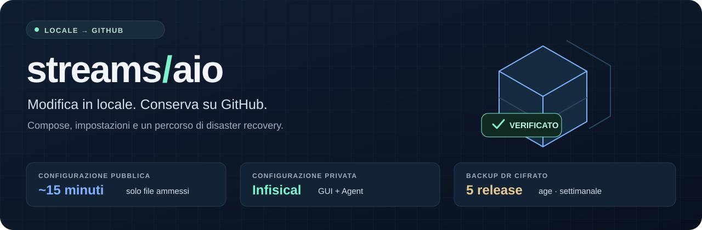
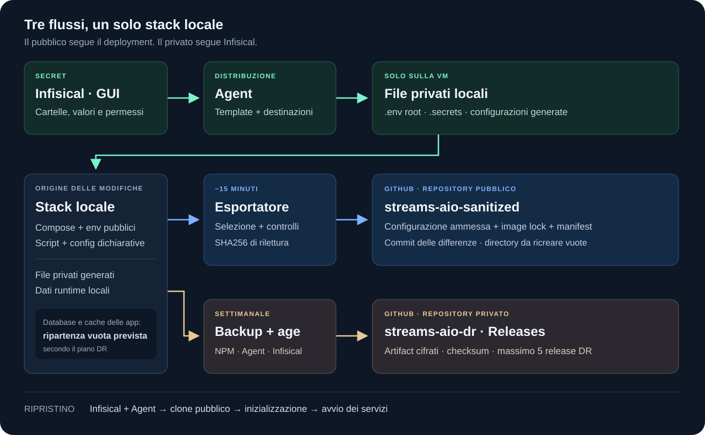

# Streams AIO · configurazione e disaster recovery

[](https://github.com/dav1dera/streams-aio-sanitized/actions/workflows/public-sync-tests.yml)

**Modifichi lo stack in locale. GitHub conserva la configurazione pubblica. Infisical conserva i secret.**

Questo repository contiene Compose, impostazioni pubbliche, script e template per ricostruire lo stack Docker dopo un guasto. Un esportatore mantiene la parte pubblica allineata alle modifiche locali; un secondo processo conserva i backup indispensabili come artifact cifrati nel repository privato `streams-aio-dr`.

L'obiettivo è un **disaster recovery**: i database applicativi ricostruibili possono ripartire vuoti. Il database di Infisical, la configurazione dell'Agent e il database Nginx Proxy Manager hanno un percorso di backup dedicato.

**[Come funziona](#come-funziona)** · **[Cosa viene pubblicato](#cosa-viene-pubblicato)** · **[Esempio Comet](#esempio-pratico-aggiungere-comet)** · **[Installazione](#attivare-la-sincronizzazione)** · **[Ripristino](#ripristinare-su-un-nuovo-host)** · **[Guida pratica](docs/ESEMPI-PRATICI.md)**

## Come funziona



| Percorso | Origine → destinazione | Frequenza |
| --- | --- | --- |
| Configurazione pubblica | Stack locale → controlli → questo repository | Circa ogni 15 minuti, con un piccolo ritardo casuale |
| Distribuzione dei secret | GUI Infisical → Agent → file privati locali | Secondo il polling configurato nell'Agent |
| Backup privato | NPM + Agent + Infisical → cifratura age → GitHub Releases private | Settimanale; massimo 5 release DR |

La configurazione pubblica segue **locale → GitHub**. Il timer non distribuisce modifiche GitHub ai container e non avvia servizi nuovi: prima applichi il servizio sulla VM, poi l'esportatore registra la sua configurazione e l'immagine effettiva.

Il worker vive in una cartella separata dal deployment. Pubblica un commit solo quando ci sono differenze, controlla la rilettura SHA256 e conserva la cronologia con aggiornamenti normali, senza force-push.

## Cosa viene pubblicato

| Contenuto locale | Comportamento |
| --- | --- |
| `docker-compose.yml` | Servizi aggiunti/rimossi, porte, mount, dipendenze e riferimenti alle variabili |
| `data/<servizio>/.env` e `.env.example` | Impostazioni pubbliche filtrate; chiavi private escluse |
| `config/public/**`, `config/templates/**`, `data/<servizio>/public/**` | File di testo pubblici ammessi, dopo i controlli sul contenuto |
| Configurazioni miste già dichiarate nel piano DR | Impostazioni e codice aggiornati; riferimenti Infisical preservati |
| Directory montate dai servizi | Percorsi, proprietario e permessi necessari per ricrearle vuote |
| Script, documentazione e file di testo ammessi alla radice | Nuovi file e successive modifiche locali, con le eccezioni descritte sotto |
| `.env` alla radice, `.secrets/**`, `.generated/**` | Esclusi dal repository pubblico |
| Database, cache, log, chiavi, certificati, archivi e altri file runtime | Esclusi, anche dentro cartelle di servizi nuovi |

La selezione usa sia `.gitignore` sia regole proprie dell'esportatore. Una regola di esclusione vale anche per file runtime senza estensione; una negazione in `.gitignore` non può rendere esportabile un database. Gli ignore aggiuntivi del deployment vengono conservati.

**Se un controllo non passa, l'intera pubblicazione si ferma.** Un nome innocuo non rende sicuro un file: mantieni i valori privati in Infisical e nelle destinazioni private. La sanitizzazione non può riconoscere ogni possibile segreto arbitrario.

Una configurazione nuova che mescola impostazioni e secret richiede un template e associazioni esplicite, una volta. Un nuovo target dell'Agent richiede il suo mapping locale. Le impostazioni presenti soltanto nel database di un'app possono essere perse quando quel database riparte vuoto.

## Organizzare un servizio

```text
/home/pi/streams-aio/                 deployment locale
├── docker-compose.yml               dichiarazioni pubbliche
├── data/
│   └── comet/
│       ├── .env                     impostazioni pubbliche
│       ├── public/                  eventuali file pubblici ammessi
│       └── data/                    database, cache e output privati
├── .env                             variabili root private, generate dall'Agent
├── .secrets/
│   └── comet.env                    variabili private, generate dall'Agent
└── .generated/                      configurazioni private generate
```

Compose legge prima il file pubblico e poi quello privato. A parità di chiave, il file successivo prevale; le variabili dichiarate in `environment:` hanno precedenza sui file. I valori sensibili appartengono alle sorgenti private. Vedi la [documentazione Docker sugli env file](https://docs.docker.com/reference/compose-file/services/#env_file).

Le configurazioni gestite dalle applicazioni, come quelle di Honey, Headscale/Headplane, Jackett e Seanime, sono inizializzate una volta sul nuovo host. L'Agent non deve sovrascriverle continuamente. I riferimenti approvati sono in [private-config-overlays.json](config/private-config-overlays.json) e [dr-render-plan.json](config/dr-render-plan.json).

## Esempio pratico: aggiungere Comet

Esempio didattico per un servizio nuovo. Nel deployment attuale Comet è già presente; i suoi mapping, la rete e le integrazioni sono più completi. La procedura dettagliata è nella [guida Comet](docs/ESEMPI-PRATICI.md#aggiungere-comet-da-zero).

1. Crea `data/comet/data/` e un `data/comet/.env` con le sole impostazioni pubbliche:

   ```dotenv
   FASTAPI_HOST=0.0.0.0
   FASTAPI_PORT=2020
   FASTAPI_WORKERS=1
   DATABASE_TYPE=postgresql
   LIVE_TORRENT_CACHE_TTL=86400
   BACKGROUND_SCRAPER_ENABLED=false
   COMETNET_ENABLED=false
   ```

2. Dalla GUI Infisical crea i secret di Comet. Configura l'Agent, una volta, per generare `.secrets/comet.env`. Database e utente PostgreSQL devono essere predisposti e inclusi nel bootstrap DR.

3. Aggiungi questo schema sotto il `services:` esistente, adattando la rete al deployment:

   ```yaml
   comet:
     image: g0ldyy/comet:latest
     restart: unless-stopped
     user: "1000:1000"
     env_file:
       - ./data/comet/.env
       - ./.secrets/comet.env
     volumes:
       - ./data/comet/data:/app/data
     ports:
       - "127.0.0.1:2020:2020"
     depends_on:
       postgres:
         condition: service_healthy
   ```

4. Verifica senza stampare le configurazioni e avvia il servizio:

   ```bash
   cd /home/pi/streams-aio
   test -s .secrets/comet.env &&
   docker compose --profile all config --quiet &&
   docker compose --profile all up -d comet
   ```

5. Il timer registra la parte pubblica. Dopo un nuovo mapping Agent, esegui anche `sudo systemctl start streams-aio-dr.service` per conservare subito il bootstrap privato aggiornato.

Su GitHub arrivano Compose, impostazioni pubbliche, image lock e struttura delle directory. I valori privati restano in Infisical; il contenuto di `data/comet/data/` resta escluso. L'esempio usa le [opzioni di Comet](https://github.com/g0ldyy/comet/blob/main/.env-sample) e il suo [deployment ufficiale](https://github.com/g0ldyy/comet/blob/main/deployment/docker-compose.yml).

## Modifiche quotidiane

| Operazione | Come farla | Cosa succede dopo |
| --- | --- | --- |
| Cambiare un TTL o un worker | Modifica il `.env` pubblico locale e applica il servizio | La modifica ammessa viene esportata al prossimo controllo |
| Cambiare una password già configurata | GUI Infisical | L'Agent aggiorna il file; il container può richiedere una ricreazione |
| Aggiungere un container | Compose + env pubblico + mapping Agent se necessario | Il worker aggiorna configurazione e inventario dopo l'applicazione locale |
| Togliere un container | Ferma il servizio interessato, poi rimuovilo dal Compose | Il worker rimuove i riferimenti pubblici inutilizzati; i dati locali restano |
| Aggiungere file di configurazione pubblici | Usa una directory pubblica ammessa | I file di testo ammessi vengono controllati ed esportati |
| Aggiungere configurazione mista o un database PostgreSQL condiviso | Aggiorna anche il contratto di bootstrap sul repo pubblico | Il ripristino dispone delle associazioni e dell'inizializzazione necessarie |

Comandi completi, template Agent e casi particolari: [esempi pratici](docs/ESEMPI-PRATICI.md).

## Attivare la sincronizzazione

Il deployment di riferimento usa `/home/pi/streams-aio`, utente `pi`, un worker separato e i due timer systemd. Per altri host adatta percorsi, utente e unità.

Prerequisiti: Git, Python 3.11+ con `venv`, GitHub CLI autenticata con accesso di scrittura al repo pubblico, Docker/Compose accessibili all'utente del servizio e Infisical Agent già configurato. Il backup cifrato ha un'installazione separata nel repository privato.

<details>
<summary><strong>Installazione iniziale del worker pubblico</strong></summary>

Esegui sulla VM del deployment. La cartella `tooling` deve essere nuova; per un worker esistente usa la procedura di aggiornamento sotto.

```bash
SYNC_HOME=/home/pi/.local/share/streams-aio-public-sync
sudo apt-get install -y git gh python3-venv &&
mkdir -p "$SYNC_HOME" &&
git clone --depth 1 https://github.com/dav1dera/streams-aio-sanitized.git "$SYNC_HOME/tooling" &&
python3 -m venv "$SYNC_HOME/venv" &&
"$SYNC_HOME/venv/bin/python" -m pip install -r "$SYNC_HOME/tooling/scripts/requirements-public-sync.txt"
```

Autentica GitHub CLI come utente `pi`, per esempio con `gh auth login --hostname github.com`. L'account deve poter scrivere nel repository pubblico. Le credenziali di GitHub restano fuori dal repo.

Controlla prima senza pubblicare:

```bash
"$SYNC_HOME/venv/bin/python" -B "$SYNC_HOME/tooling/scripts/sync-public-stack.py" \
  --source /home/pi/streams-aio --seamless
```

Dopo `PUBLIC_SYNC_CHECK PASS`, installa policy e unità. Il verificatore avvia una pubblicazione reale:

```bash
"$SYNC_HOME/venv/bin/python" -B "$SYNC_HOME/tooling/scripts/install-public-sync-policy.py" \
  --source /home/pi/streams-aio &&
sudo install -m 644 "$SYNC_HOME/tooling/systemd/streams-aio-public-sync.service" /etc/systemd/system/ &&
sudo install -m 644 "$SYNC_HOME/tooling/systemd/streams-aio-public-sync.timer" /etc/systemd/system/ &&
sudo systemctl daemon-reload &&
sudo systemctl enable --now streams-aio-public-sync.timer &&
sudo -v &&
"$SYNC_HOME/tooling/scripts/verify-public-sync-systemd.sh"
```

La sola clonazione non prepara Infisical, i file privati o un deployment nuovo. Per questi input segui i prerequisiti e la procedura di ripristino.

</details>

Per aggiornare **un worker esistente**, aggiorna il suo clone e controlla senza pubblicazione:

```bash
SYNC_HOME=/home/pi/.local/share/streams-aio-public-sync
git -C "$SYNC_HOME/tooling" pull --ff-only &&
"$SYNC_HOME/venv/bin/python" -B "$SYNC_HOME/tooling/scripts/sync-public-stack.py" \
  --source /home/pi/streams-aio --seamless
```

Le modifiche alle unità richiedono una nuova installazione e `daemon-reload`, come nella [guida di attivazione](docs/SEAMLESS-PUBLIC-SYNC.md#enable-on-docker-stack). Il clone del worker è separato dalla cartella dello stack in esecuzione.

## Controllare ed eseguire i processi

```bash
# Stato e prossimo avvio dei due timer.
systemctl list-timers streams-aio-public-sync.timer streams-aio-dr.timer --no-pager --full

# Risultato dell'ultima esecuzione, senza contenuti dei file o log dei secret.
systemctl show streams-aio-public-sync.service streams-aio-dr.service \
  -p Id -p Result -p ExecMainStatus -p ExecMainExitTimestamp

# Pubblica subito le modifiche locali ammesse.
sudo systemctl start streams-aio-public-sync.service

# Crea subito un nuovo backup DR cifrato.
sudo systemctl start streams-aio-dr.service
```

Un servizio `oneshot` può risultare `inactive` dopo un'esecuzione riuscita: controlla `Result=success`, `ExecMainStatus=0` e il timer attivo. In caso di blocco esegui il controllo senza pubblicazione e usa il codice di errore; i dettagli sono nella [guida pratica](docs/ESEMPI-PRATICI.md#diagnosticare-un-blocco).

## Backup privato e retention

Il processo separato `streams-aio-dr` conserva in **GitHub Releases private**:

- Snapshot coerente del database SQLite di Nginx Proxy Manager.
- Configurazione dell'Agent e materiale di bootstrap privato.
- Dump PostgreSQL, globals e configurazione del server Infisical.
- Manifest leggeri e checksum per la verifica degli artifact.

Gli artifact sono cifrati con **age prima dell'upload**. Il processo verifica checksum e assenza di plaintext/chiavi private nei materiali pubblicabili; il cleanup remoto segue il successo della pubblicazione verificata e della retention. Sono mantenute al massimo **5 release DR** del gruppo gestito.

Il timer di riferimento parte la domenica alle **04:30**, con un ritardo casuale fino a 10 minuti e recupero degli avvii persi. L'orario segue il fuso dell'host, `Europe/Rome` nel deployment di riferimento.

**La sincronizzazione pubblica non anticipa il backup settimanale.** Dopo modifiche importanti ai secret o all'Agent, avvia un backup manuale. Conserva le chiavi age private e le credenziali di bootstrap fuori da entrambi i repository, in un luogo recuperabile se la VM viene persa. La vecchia cronologia Git dei backup rimane; la migrazione non l'ha riscritta.

## Ripristinare su un nuovo host

La sequenza di ripristino collega i due repository:

1. Recupera l'accesso al repository privato, le chiavi age e una release DR verificata.
2. Ripristina Infisical e il suo database/configurazione; recupera l'Agent e le credenziali di bootstrap.
3. Prepara un clone pubblico su un **host nuovo**, installa le dipendenze e fornisci gli input privati dichiarati.
4. Genera una volta env/configurazioni, crea le directory vuote e inizializza i database applicativi previsti.
5. Ripristina il database NPM e gli eventuali payload logici AIO; valida Compose e avvia i servizi nell'ordine previsto.
6. Completa enrollment, autorizzazioni e riemissione TLS richiesti dai servizi; riattiva i timer dopo la verifica.

Gli strumenti `dr.py init/render/prepare-state` e gli importatori sono per il nuovo host; rifiutano destinazioni già inizializzate. La procedura dettagliata è in [BOOTSTRAP.md](docs/BOOTSTRAP.md), [DISASTER-RECOVERY.md](docs/DISASTER-RECOVERY.md), [NPM-RECOVERY.md](docs/NPM-RECOVERY.md) e [AIO-EXPORT-IMPORT.md](docs/AIO-EXPORT-IMPORT.md).

La ripartenza vuota di cache, sessioni e database ricostruibili è prevista. I file runtime unici aggiunti in futuro, come media personali, richiedono una scelta di backup dedicata. I flussi AIOStreams/AIOMetadata esistenti mantengono i loro contratti di export/import.

I test usano input sintetici e la prima sincronizzazione reale è stata verificata. Questo non costituisce una prova completa di ripristino su un host nuovo; la disponibilità degli input privati va verificata separatamente.

## Domande frequenti

**Posso modificare il repository direttamente su GitHub?** Sì. Compose, env dei servizi e template attivi seguono però il locale e possono essere sovrascritti al prossimo controllo. Per script e documenti già noti, un sorgente locale invariato conserva le modifiche GitHub; una successiva modifica locale torna a essere la sorgente. Policy, CI, unità e controlli dell'esportatore restano gestiti sul repo pubblico.

**Basta creare una cartella su Infisical per un container nuovo?** Serve anche il template/destinazione nell'Agent e il relativo `env_file` nel Compose. Il worker non inventa il mapping. Un nuovo target viene indicato nel layout come dipendente dall'Agent ripristinato.

**Posso fare `git add .` dalla cartella dello stack?** L'automazione usa l'esportatore, che seleziona e controlla i file. Un push manuale lo bypassa; `.gitignore` non rimuove file già tracciati. Per aggiornare la parte pubblica usa il servizio di sincronizzazione.

**La GUI dell'app viene salvata?** Sono esportati i file dichiarativi già gestiti dal piano. Le preferenze presenti solo nel database runtime non vengono estratte. Honey conserva etichette pubbliche generiche e associazioni posizionali: modifiche al suo layout privato richiedono una revisione.

## Documentazione e riferimenti

| Guida | Contenuto |
| --- | --- |
| [Esempi pratici](docs/ESEMPI-PRATICI.md) | Comet, mapping Agent, impostazioni, secret, rimozioni e diagnostica |
| [Seamless public sync](docs/SEAMLESS-PUBLIC-SYNC.md) | Regole complete della modalità attiva e limiti della selezione |
| [Public stack sync](docs/PUBLIC-STACK-SYNC.md) | Modalità precedente a schema fisso e dettagli del trasporto |
| [Bootstrap](docs/BOOTSTRAP.md) | Prerequisiti di un deployment nuovo |
| [Disaster recovery](docs/DISASTER-RECOVERY.md) | Stato ricostruibile, input privati e strumenti di ripristino |
| [NPM recovery](docs/NPM-RECOVERY.md) | Proxy, database NPM e riemissione TLS |
| [AIO export/import](docs/AIO-EXPORT-IMPORT.md) | Payload logici AIOStreams/AIOMetadata |
| [Manifest DR](config/dr-manifest.yaml) · [Layout pubblico](config/public-stack-layout.json) | Servizi, riferimenti e directory da ricreare |

Gli esempi contengono nomi pubblici e segnaposto. I valori reali di credenziali e configurazione privata appartengono a Infisical e al percorso di backup cifrato.

